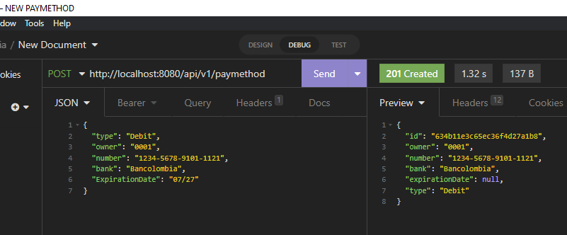
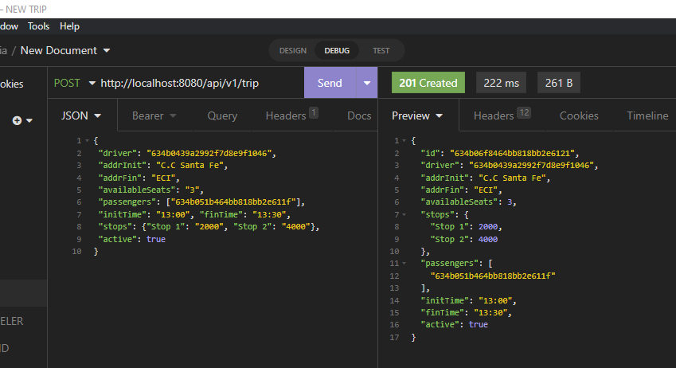
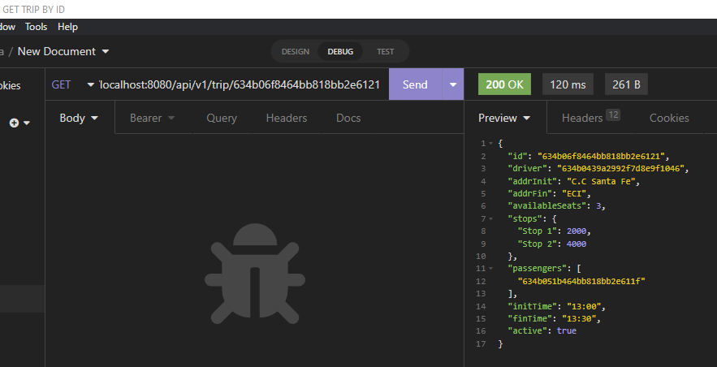

# UNIWheels - Back Development
 
## Contributors:

- Camilo Andrés Pichimata Cárdenas
- Eduardo Ospina Mejía
- José Manuel Gamboa Gómez
- Kristhian Segura Guatibonza
- Zuly Valentina Vargas Ramírez


## Description

UniWheels offers ridesharing between trusted users in a fast and easy way, you can find your ideal ride at a very low price and why not save while driving.
Post your next round trip on UniWheels and get income.
With UniWheels you can travel in the company of people you know who study at the same university and have to travel the same route as you to get home.

This repository includes the backend development of the application. 


User stories Sprint 1 :

[Taiga with UH](https://tree.taiga.io/project/zulyvargasr-uniwheels/taskboard/sprint-1-2021)

## Test

To test the application do the following steps:

### Installing

To download the project run:

  ```bash
    git clone https://github.com/UNIWheels/UNIWheels-Back.git
  ```

### Final points available :

1. First, you need to create a user:

**Type**: POST

**Url**: http://localhost:8080/api/v1/driverusers/

```json
{
    "id": "000123",
    "name": "User ",
    "lastName": "test 2",
    "email": "test2user@gmail.com",
    "password": "testdos",
    "university": "university",
    "phone": "1234",
    "rol": "ADMIN",
    "document": "1234",
    "photoCar": "car.png",
    "modeloCar": "mazda",
    "plate": "ABC345"
}
```


2. Now you can use the endpoints adding the token. For obtain a token of Bearer type use:

    **Type**: POST

    **Url**: http://localhost:8080/v1/auth

    ```json
    Body: {"email": "test2user@gmail.com", "password": "testdos"}
     ```
    


3.  For the travel user you can add a paymethod:

**Type**: POST

**Url**: http://localhost:8080/api/v1/paymethots

```json
{"type": "Debito", "owner": "0001", "number": "1234-5678-9101-1121", "bank": "Bancolombia", "ExpirationDate": "07/27"}
```



4. Obtain the paymethods:

**Type**: GET

**Url**: http://localhost:8080/api/v1/paymethots


5. Add a new trip:

**Type**: POST

**Url**: http://localhost:8080/api/v1/trips

```json

{"driver": "1", "addrInit": "Calle 123", "addrFin": "Kra 456", "availableSeats": "3", "passengers": ["0002", "0004"], "initTime": "13:00", "finTime": "14:00", "stops": {"Stpo 1": "2000", "Stop 2": "4000"}, "active": true}
```



6. Get a trip by a id:


**Type**: GET

**Url**: http://localhost:8080/api/v1/trips/1




7. Add a new comment

**Type**: POST

**Url**: http://localhost:8080/api/v1/comments

```json
{"user": "0001", "creationDate": "2022-09-15", "modificationDate": "2022-09-15", "description": "Es un muy bien servicio", "type": "COMPLAINT"}
```


## Built With

* [Gradle](https://gradle.org) - Management tool used for projects build, dependency and documentation.
* [Java ](https://www.oracle.com/co/java/technologies/javase/javase-jdk8-downloads.html)     - Programming language and computing platform.
