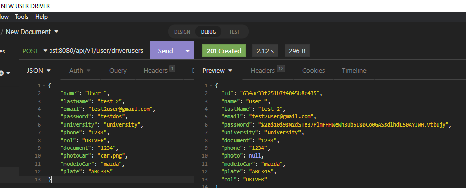

# PoolWheels - Back Development

## Contributors:

- Camilo Andrés Pichimata Cárdenas
- Eduardo Ospina Mejía
- José Manuel Gamboa Gómez
- Kristhian Segura Guatibonza
- Zuly Valentina Vargas Ramírez
- Natalia Orjuela Hernandez

## Description

PoolWheels offers ridesharing between trusted users in a fast and easy way, you can find your ideal ride at a very low price and why not save while driving.
Post your next round trip on PoolWheels and get income.
With PoolWheels you can travel in the company of people you know who study at the same university and have to travel the same route as you to get home.

This repository includes the backend development of the application.

User stories Sprint 1 :

[Taiga with UH](https://tree.taiga.io/project/zulyvargasr-uniwheels/taskboard/sprint-1-2021)

## Test

To test the application do the following steps:

### Installing

To download the project run:

```bash
  git clone https://github.com/PoolWheels/PoolWheels-Back.git
```

The project has 4 different controllers. Each one groups the endpoints corresponding to the service it is responsible for.
The controllers are: UserController, PayMethodController, TripController, CommentController.

## Final points available :

### Control with user services:

**Endpoint:** /api/v1/user/{...}

1. First, you need to create a user. In this case a driver user is created:

**Type**: POST

**Url**: http://localhost:8080/api/v1/user/driverusers

```json
{
  "name": "User ",
  "lastName": "test 2",
  "email": "test2user@gmail.com",
  "password": "testdos",
  "university": "university",
  "phone": "1234",
  "rol": "DRIVER",
  "document": "1234",
  "photoCar": "car.png",
  "modeloCar": "mazda",
  "plate": "ABC345"
}
```



2. Now you can use the endpoints adding the token. For obtain a token of Bearer type use:

   **Type**: POST

   **Url**: http://localhost:8080/v1/auth

   ```json
   Body: {"email": "test2user@gmail.com", "password": "testdos"}
   ```


3. Get a user by their id:

**Type**: GET

**Url**: http://localhost:8080/api/v1/user/driverusers/634ae33f251b7f4045b8e435

Remember to add the token obtained in the request.


4. Updating a user's information. In this case, the name of the the university.

**Type**: PUT

**Url**: http://localhost:8080/api/v1/user/driverusers/634ae33f251b7f4045b8e435


5. Delete a user. This is only allowed with administrator permissions.

**Type**: DELETE

**Url**: http://localhost:8080/api/v1/user/driverusers/005


## Built With

- [Gradle](https://gradle.org) - Management tool used for projects build, dependency and documentation.
- [Java ](https://www.oracle.com/co/java/technologies/javase/javase-jdk8-downloads.html) - Programming language and computing platform.
